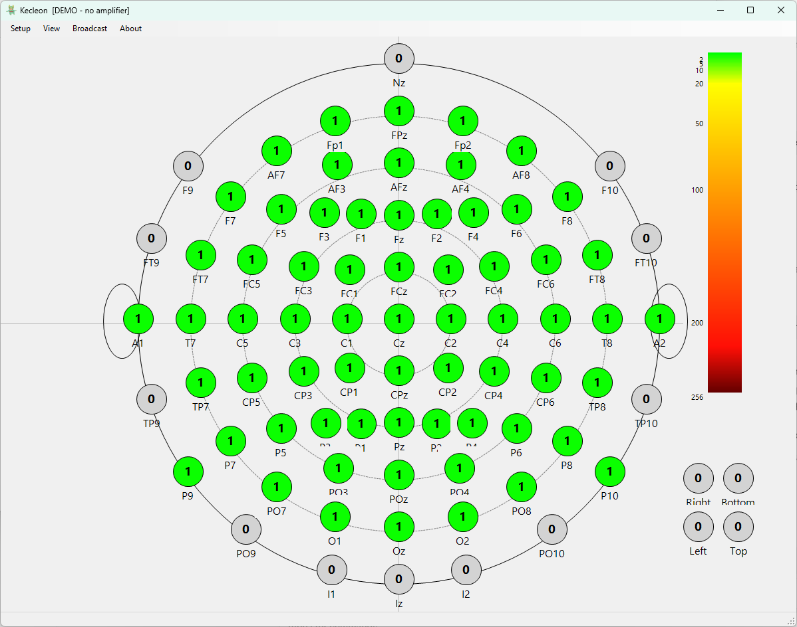

# Charmeleon


Electrode impedance checker for EEG recording sessions. Connects to an EEGO or
TMSi amplifier and shows the live impedance of every electrode on a head map, so
you can fix poor contacts before the recording starts.

---

## Download and install

Grab the latest installer from the [**Releases**](https://github.com/markspan/Charmeleon/releases/latest)
page (`CharmeleonSetup-x.y.z.exe`) and run it. It installs Charmeleon, bundles
the EEGO SDK, and registers the web-view network port so the browser display
works without any further setup.

- **EEGO (eemagine)** users: nothing else is needed.
- **TMSi Refa** users: also install the TMSi device driver (it places
  `TMSiSDK.dll` in `C:\Windows\System32`).

No amplifier to hand? Charmeleon starts in **demo mode**: use the up and down
arrow keys to sweep the impedance values and explore the display.

---

## What is electrode impedance, and why does it matter?

When an EEG electrode is placed on the scalp, it needs to make good electrical contact with the skin. **Impedance** is a measure of how much the electrode-skin interface resists the flow of the tiny electrical signals generated by the brain. It is expressed in kOhm (kilo-ohms).

A high impedance means that the electrode is not making good contact (perhaps because of hair in the way, insufficient gel, dry skin, or a poorly seated electrode). When impedance is high, the brain signal picks up more electrical noise from the environment (power lines, fluorescent lights, equipment) along the way. The result is a noisy EEG recording.

A low impedance means good contact. The signal passes through cleanly and the recording quality is high. As a general guideline, impedances below 10-20 kOhm are considered acceptable for most EEG systems, though the exact threshold depends on the amplifier and the research question.

**Charmeleon** displays the impedance of every electrode in real time, so you can see at a glance which electrodes need more gel or extra prep before the recording starts.

### How the measurement works

The amplifier briefly drives a tiny, known alternating current through each electrode and measures the resulting voltage. Impedance is then simply voltage divided by current (Z = V / I). The current is far too small to be felt and is well within safety limits. Charmeleon reads this value for every channel a few times per second and paints it on the head map, so preparation and measurement happen at the same time: add gel, watch the colour change.

<details>
<summary><strong>Background: what impedance actually is and what it means for EEG quality</strong></summary>

### The Actual Signal Path

The relevant circuit is a voltage divider. The signal source (the electrode-skin interface, with impedance Z_electrode) drives an amplifier with input impedance Z_in. The fraction of the true signal voltage that reaches the amplifier input is:

**V_measured / V_true = Z_in / (Z_in + Z_electrode)**

So what matters is **not** Z_electrode in absolute terms, but the **ratio** Z_in / Z_electrode.

### Modern Amplifier Input Impedances

- **1970s-80s amplifiers:** Z_in ~ 1-10 MΩ; electrode impedance of 5-20 kΩ was genuinely problematic (ratio of only 50-2000:1)
- **Modern active-electrode amplifiers (e.g. TMSi, BrainProducts actiCHamp, Biosemi ActiveTwo):** Z_in typically **1 GΩ or higher** in differential mode

At 1 GΩ input impedance and 50 kΩ electrode impedance, the voltage divider ratio is 20,000:1. The signal attenuation is 0.005%, negligible for any EEG purpose.

**Conclusion 1: For modern high-impedance amplifiers, moderate electrode impedance (even 50-100 kΩ) causes essentially zero signal attenuation.**

### What High Electrode Impedance Actually Does Cause

**1. Noise pickup (thermal noise and EMI)**

A resistor generates Johnson-Nyquist thermal noise with a spectral density of e_n = sqrt(4 k T R). A handy anchor is that 1 kΩ produces about 4 nV/√Hz at room temperature, and the density grows with the square root of impedance: roughly 29 nV/√Hz at 50 kΩ and 90 nV/√Hz at 500 kΩ. EEG signals are in the µV range, so even at high impedance this thermal contribution is small in absolute terms; it is one reason, among several, to avoid very high impedances rather than the dominant one.

**2. Common-mode rejection (CMRR) degradation: the real issue**

A differential amplifier rejects signals common to both inputs (mains hum, body movement artifact) only to the extent that both inputs see the same impedance. If electrode A has 5 kΩ and electrode B has 50 kΩ, a common-mode interference signal is asymmetrically attenuated and thereby **converted to a differential signal** that passes straight through.

A 100 dB CMRR amplifier can degrade to effectively 40-60 dB CMRR with large inter-electrode impedance mismatches. In a 50 Hz environment this is catastrophic.

**Conclusion 2: Impedance balance across electrodes matters far more than absolute impedance level. A uniform 30 kΩ is better than a mix of 2 kΩ and 25 kΩ.**

**3. DC offset and drift**

High electrode-skin impedance is associated with larger and less stable DC offset potentials at the electrode-electrolyte-skin junction.

**4. Sensitivity to cable movement and triboelectric noise**

High source impedance combined with cable capacitance to ground creates a path by which cable flex generates charge injection artifacts.

### Summary

| Effect | Governed by | Critical threshold |
|---|---|---|
| Signal attenuation | Z_electrode / Z_in ratio | Negligible at modern Z_in |
| Thermal noise | Absolute Z_electrode | Matters above ~200 kΩ |
| CMRR degradation | Inter-electrode Z mismatch | Keep mismatch < 5-10x |
| DC drift / stability | Absolute Z_electrode | Lower is better; < 50 kΩ practical target |
| EMI / triboelectric | Absolute Z_electrode | Matters in noisy environments |

The obsession with getting below 5 kΩ is partly legitimate habit, partly historical inertia, and partly a proxy for "the electrode is properly seated and making good contact", which is a real quality indicator even if the impedance number itself is not the causal variable.

</details>



---

## Using Charmeleon


Connects to a hardware amplifier and displays live electrode impedances on a head map.

### Supported amplifiers

| Amplifier | Notes |
|-----------|-------|
| EEGO (eemagine) | Auto-detected; 64 reference channels |
| [TMSi Refa](docs/tmsi.md) | Auto-detected if no EEGO is found |

If both are present, EEGO is chosen first. If neither is found, Charmeleon opens in demo mode.

### The head map

Each circle represents one electrode in a cap. The colour gives a quick visual indication of impedance quality:

| Colour | Impedance |
|--------|-----------|
| Green | Low (good contact, 0-20 kOhm) |
| Yellow/orange | Medium (20-100 kOhm) |
| Red | High (poor contact, >100 kOhm) |
| Grey | Electrode marked inactive |

The scale bar on the right shows the full 0 to 255 kOhm range.

> **Note:** the colour boundaries in the table above are approximate guides only. Always read the numeric value shown inside each circle (that is the actual impedance in kOhm). A reading of `Inf` means the channel is open (no contact at all).

### Interactions

- **Click an electrode** to toggle it active/inactive (grey = not in use for this recording).
- **Click the channel number label** (below the circle) to assign a hardware channel (see the TMSi montage section below).
- **View > View Channels** switches the circle display from impedance value to electrode name, with hardware channel numbers shown below.
- **View > Toggle Theme** switches between light and dark backgrounds.
- **Setup > Open/Save Montage** loads or saves the electrode-to-channel mapping as a JSON file.

### Web view: see impedances on any phone, tablet or second PC

**Web > Web View...** opens a dialog showing a QR code and a URL. Scan the code with any phone or tablet on the same Wi-Fi network, or type the URL into any browser on any device on the network, and the impedance head map opens in the browser. Nothing needs to be installed on the viewing device.

The page connects to a small web server built into Charmeleon (port 8765) and updates the head map once per second. It requests the Screen Wake Lock so the display stays on during cap preparation (the HTTPS connection provides the secure context the Wake Lock needs, so it works on phones and tablets), and reconnects automatically if the connection drops. You can pan and zoom (pinch or scroll) to enlarge any part of the map.

> **First-time certificate warning:** the connection uses HTTPS with a self-signed certificate, so the first time each device connects the browser shows a `not private` or `not trusted` warning. Choose **Advanced** and then **Proceed** (the exact wording varies by browser) to continue. This is expected for a self-signed certificate on a local network and only needs to be accepted once per device.

> The installer opens the port through the firewall for you. If you run Charmeleon without having run the installer first, open a command prompt as administrator and run:
> ```
> netsh advfirewall firewall add rule name="Charmeleon Web" dir=in action=allow protocol=TCP localport=8765
> ```

---

## Preparing the cap: best practices

Good data starts at the cap. This short video walks through the practical steps of seating an electrode cap and getting clean, balanced contact:

▶️ **[Instructional video: setting up an electrode cap](https://unishare.nl/index.php/s/ejyDJNGgLJXD6kZ?dir=/Instructional%20Videos&openfile=75269356)** (best practices, University of Groningen)

A few rules of thumb that Charmeleon makes easy to follow:

- **Reference and ground first.** Every channel is measured against the reference, so if the reference contact is poor, *every* electrode looks bad. Get the reference and ground green before chasing individual channels.
- **Part the hair, do not scrub the skin.** Move hair aside so the electrode sits on scalp. A gentle rotation as you add gel helps; you are aiming for contact, not abrasion.
- **Enough gel, not too much.** Add gel until the impedance drops, but avoid bridging neighbouring electrodes with excess gel (that electrically couples two channels and shows up as two suspiciously similar readings).
- **Aim for balance, not just a low number.** As the background section explains, a uniform 20-30 kOhm across the cap beats a mix of very low and very high values. Even out the outliers rather than over-prepping the ones that are already fine.
- **Give it a moment.** Impedance keeps falling for a few seconds after gel is applied as it spreads; re-check before deciding an electrode needs more work.
- **Watch the colour, confirm the number.** Use the colours to spot problems at a glance, then read the value inside the circle to decide whether it is good enough for your setup.

---

## Viewing impedances in the EEG cabin

In many EEG labs the operator sits in a separate room from the participant. The operator has the acquisition PC; the participant has a monitor in the EEG cabin. During cap preparation the person applying the cap and gel is in the cabin, but the impedance display is on the acquisition PC in the operator room.

The built-in **web view** solves this with nothing to install in the cabin. Any device with a browser on the same network (the task PC whose monitor is in the cabin, a tablet, or a phone) can open the live head map:

1. On the acquisition PC, open Charmeleon and connect to the amplifier as normal.
2. Go to **Web > Web View...** and either scan the QR code or read off the URL (for example `https://192.168.1.42:8765/`).
3. Open that URL in a browser on the cabin device. The live head map appears and updates once per second.

From this point on, the person in the cabin sees every electrode's impedance without any communication with the operator room. Inactive electrodes (grey in Charmeleon) appear grey in the web view as well. Because the viewer is just a web page, it works on any operating system and needs no configuration beyond being on the same network.

---

## Tutorial: setting up a TMSi Refa montage

This section applies only to the **TMSi Refa** amplifier. If you are using an EEGO amplifier, the channel mapping is fixed by the hardware and no montage setup is needed.

### Why the Refa needs a montage

The TMSi Refa has a **head box**: the blue box near the participant into which the individual electrode cables are plugged. The head box has numbered sockets (hardware channels 1, 2, 3, ...), but there is no fixed rule about which cap electrode goes into which socket. This is decided by whoever cables up the cap, and it can differ between labs or even between sessions.

Charmeleon therefore needs to be told which hardware channel corresponds to which electrode name. This mapping is called a **montage**. Once it is saved, you simply reload it at the start of each session. **You only need to create the montage once**, as long as you cable the cap consistently (and only when you use a non-standard montage).

If your lab always cables the cap the same way, the montage never changes. If different researchers cable differently, each person saves their own montage file. The repository ships ready-made `WaveGuard CW1308` montages as examples.

### Step 1: open View Channels mode

Open Charmeleon with the Refa connected. Go to **View > View Channels**. The circles now show electrode names (Fp1, Cz, etc.) and the small label beneath each circle shows the hardware channel number currently assigned to that position.

### Step 2: assign hardware channels

Look at the head box. For each electrode, note which numbered socket its cable is plugged into.

Click the **channel number label** below the circle for that electrode. A small text box appears: type the channel number and press Enter. Repeat for every electrode in use.

Electrodes that are not connected can be clicked to toggle them **inactive** (they turn grey).

### Step 3: save the montage

Go to **Setup > Save Montage** and save to a descriptive filename (e.g. `Refa_64ch_LabA.json`). This file stores the complete name-to-channel mapping.

At the start of each subsequent session, go to **Setup > Open Montage** and reload it. From that point on, impedances will be shown under the correct electrode names automatically.

### Step 4: check impedances

Toggle **View > View Channels** off. The circles now show live impedance values coloured by quality. Apply gel to any electrode that is not yet in an acceptable range before starting the recording.

---

## Requirements

- Windows 10 or 11, 64-bit
- An EEGO (eemagine) or TMSi Refa amplifier (or neither, for demo mode)
- EEGO: `eego-SDK.dll` (bundled with the installer)
- TMSi: `TMSiSDK.dll` in `C:\Windows\System32` (installed with the TMSi device driver)

---

*Charmeleon, University of Groningen, 2025-2026. Written by M.M. Span.*
