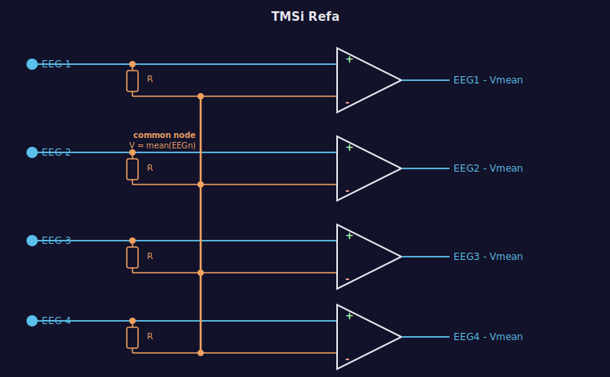

# The TMSi Refa amplifier input topology

The TMSi Refa ("Reference Amplifier") uses a patented analog input stage that is fundamentally different from conventional EEG amplifiers. 

## The conventional approach and its problem

Most amplifiers measure each channel relative to a single dedicated **reference electrode** placed on the scalp (mastoid, nose, Cz). Every channel sees:

> output = EEGn - V_reference

The quality of the recording then depends heavily on the quality of that one reference electrode. If it has high impedance, sits in a noisy location, or picks up an artifact, every channel is corrupted.

## The Refa approach: resistive average reference

The Refa eliminates the dedicated reference electrode entirely. Instead:

1. Each electrode signal connects to the **+ input** of its own differential amplifier.
2. The same signal also passes through an equal resistor **R** to a single common node shared by all channels.
3. By Kirchhoff's current law, with equal resistors, the voltage at that common node is automatically the **instantaneous mean** of all electrode voltages: no active components, no computation.
4. That common node connects to the **- input** of every differential amplifier simultaneously.

Each amplifier therefore outputs:

> EEGn - mean(EEG1 ... EEGn)

*Blue: signal path to the + input of each op-amp. Orange: resistive averaging network. Equal resistors R meet at a common node whose voltage equals the mean of all electrode voltages (by Kirchhoff current law). That mean drives the - input of every op-amp.*

## Why it amplifies signal but not noise

Any voltage that appears equally across **all** electrodes (mains hum, slow body potential, a movement artifact, amplifier DC offset) is present in the mean. Subtracting the mean removes it from every output simultaneously.

What survives is the **spatial deviation** of each electrode from the group average: the locally specific brain activity at that site. That is what gets amplified.

Formally: if a noise voltage N appears on all channels,

> output = (EEGn + N) - mean(EEG + N) = EEGn - mean(EEG)

N cancels exactly. The outputs sum to zero by construction.

## The important caveat

The circuit cannot distinguish between shared noise and shared brain signal. A genuine neural response that is truly identical across every electrode will be attenuated, because it also appears in the mean. In practice this is rarely a problem: real neural signals have spatial structure and the shared component is dominated by noise. But it is worth knowing.

## Why the montage matters

The Refa has no fixed connector-to-electrode mapping. The individual electrode cables plug into numbered sockets on the head box, and the researcher decides which socket receives which cap electrode. Charmeleon must therefore be told the mapping ("socket 7 is Fz") before it can display the correct electrode names. This is what the montage file stores. See the [montage tutorial in the main README](../README.md#tutorial-setting-up-a-tmsi-refa-montage).

